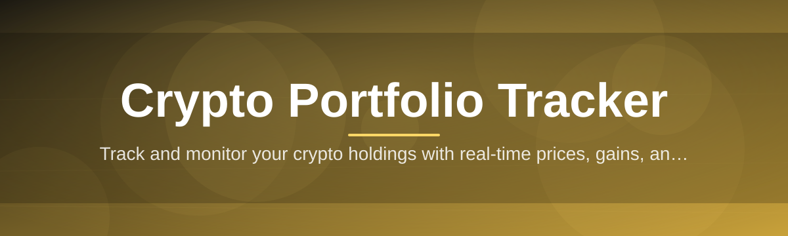
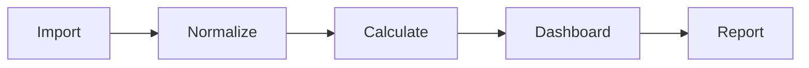

# portfolio-tracker-manager 📊🪙

  

*Your holdings, your exchanges, your gains — one clean dashboard, zero cloud dependency.*

  

## 🧭 Overview

**What this is NOT:** a browser extension that phones home, a spreadsheet template held together with duct tape, or a "connect your API keys to our cloud" service that turns your holdings into someone else's product.

**What this is:** a standalone Windows application that pulls your crypto positions across wallets and exchanges into a single, honest view of what you actually own. Portfolio-tracker-manager was built out of frustration with tools that either leak your data to third-party servers or fall apart the moment you hold more than three coins across two exchanges. It calculates real cost basis, tracks realized and unrealized P&L, and renders allocation breakdowns without ever needing an internet-connected backend to store your numbers.

This is for the holder who's tired of tab-juggling between four exchange dashboards and a half-broken Notion table. It's for the trader who wants tax-season cost-basis math done correctly the first time. It's for anyone who believes portfolio data should live on their machine, not on a stranger's server.

<blockquote>

Built for people who track sats, not sentiment.

</blockquote>

---

## 🔥 What It Actually Does

- **Multi-exchange aggregation** — merge holdings from every wallet and exchange account into one unified ledger, no manual copy-paste required.

- **Real cost-basis engine** — FIFO, LIFO, or average-cost accounting calculated automatically, so your P&L numbers hold up under scrutiny.

- **Live price syncing** — pulls current market data on your schedule, not the exchange's, keeping your view current without hammering rate limits.

- **Allocation visualizer** — pie and treemap views that show exactly how concentrated (or reckless) your portfolio actually is.

- **Historical performance charts** — track net worth over time, not just today's snapshot, with zoomable timelines.

- **Custom watchlists** — monitor assets you don't own yet, right alongside the ones you do.

- **CSV import/export** — bring in exchange trade history, push out reports for taxes or personal audit trails.

- **Offline-first storage** — your ledger lives in a local encrypted file. No account, no sync server, no leak surface.

  

> [!TIP]
> Set up watchlists before you buy — it turns "should I ape in" into an actual decision informed by allocation math instead of vibes.

---

## 🚀 Getting Started

1. Visit the landing page linked above and grab the latest build.

2. Run the installer — no admin rights, no bundled toolchains, no background services.

3. On first launch, import your trade history via CSV or add positions manually.

4. Set your base currency and refresh interval, then let the dashboard populate.

> [!NOTE]
> First sync can take a minute if you're importing years of trade history. Subsequent launches are near-instant since data is cached locally.

---

## 🖥️ System Requirements

| Requirement | Minimum |
|---|---|
| OS | Windows 10 (64-bit) or Windows 11 |
| RAM | 4 GB |
| Disk | 200 MB free |
| Dependencies | None — fully standalone |
| Internet | Optional, only for price refresh |

> [!IMPORTANT]
> No .NET runtime installs, no Python environments, no hidden background downloads. What you launch is what you get.

---

## ⚙️ How It Works

1. **Ingest** — CSV imports or manual entries feed the local ledger.

2. **Normalize** — trades are deduplicated and reconciled against existing positions.

3. **Calculate** — cost basis, P&L, and allocation percentages are computed on-device.

4. **Render** — dashboard, charts, and reports update instantly from the local store.

<strong>Why local-first instead of cloud-synced?</strong>

Cloud portfolio trackers are an attractive target — your balances, trade history, and sometimes API keys sitting on a server outside your control. Local-first removes that attack surface entirely. Your file, your disk, your rules.

---

## 🩹 Troubleshooting

**Q: My exchange CSV isn't importing correctly.**
A: Check the column headers match the expected template under Settings → Import Formats. Most exchanges change their export schema occasionally.

**Q: Prices aren't refreshing.**
A: Confirm your internet connection and check the refresh interval isn't set to Manual under Settings → Sync.

**Q: Cost basis looks off after a partial sell.**
A: Verify your accounting method (FIFO/LIFO/Average) matches what you expect — switching methods mid-history will recalculate everything retroactively.

**Q: The app won't launch after a Windows update.**
A: Re-run the installer from the landing page; a fresh binary resolves most post-update state issues.

**Q: Can I track staking rewards separately?**
A: Yes — tag incoming transactions as "Reward" during import or manual entry to keep them separate from trade P&L.

> [!WARNING]
> Deleting your local data file is irreversible. Back it up via Settings → Export before wiping or reinstalling.

---

## 🎨 UI / UX Details

- **Themes:** Light, Dark, and an OLED-friendly true-black mode.

- **Keyboard shortcuts:**

  - `Ctrl+N` — new position

  - `Ctrl+R` — force price refresh

  - `Ctrl+E` — export report

  - `Ctrl+F` — quick search across holdings

- **Settings panel:** base currency, accounting method, refresh interval, and privacy toggles all live in one place — no digging through nested menus.

---

## 🤝 Contributing & Community

Issues and pull requests are welcome. Before submitting:

- Search existing issues to avoid duplicates.

- Keep PRs focused — one fix or feature per submission.

- Describe *why* a change matters, not just *what* changed.

> [!TIP]
> Feature requests grounded in a real portfolio-tracking pain point get prioritized faster than generic "add more charts" asks.

---

## 📄 License

Released under the [MIT License](LICENSE), 2026.

---

## ⚠️ Disclaimer

Portfolio-tracker-manager is a tracking and analytics tool — it does not execute trades, custody funds, or provide financial advice. Price data may be delayed or inaccurate depending on source availability. Always verify figures against your exchange statements before making financial decisions.

